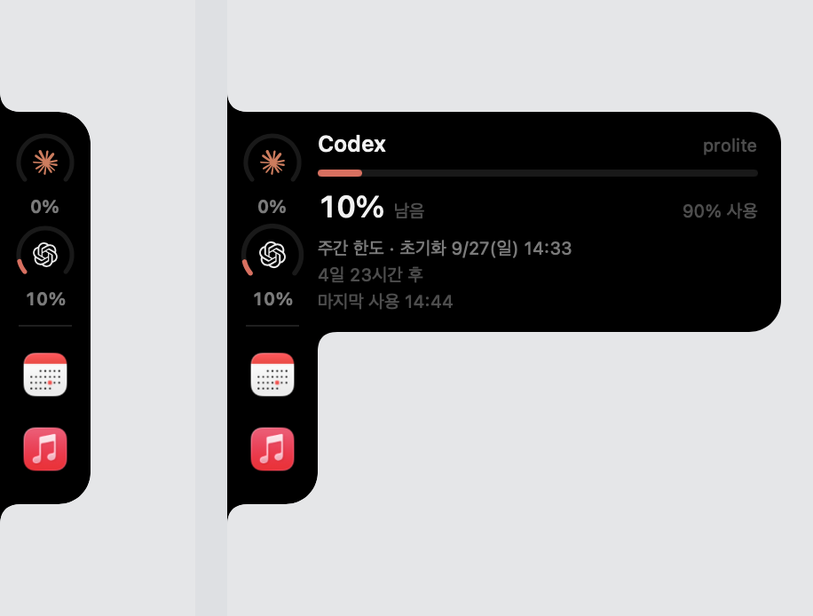
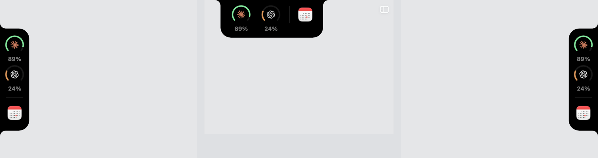

# SideNotch

맥 화면 **가장자리**에서 자라나는 노치. 끌면 왼쪽·위·오른쪽 변을 따라 붙은 채로
미끄러지고 모서리에서 방향을 튼다. Claude Code와 Codex의 남은 한도를
로고 둘레의 아크 게이지로 보여주고, 로고에 마우스를 올리면 옆으로 늘어나며
상세를 펼친다. 앱을 끌어다 놓으면 런처가 된다.

**[English README](README.md)**



세 변 중 어디에든 붙는다. 붙은 변에 맞춰 회전하고, 상세는 화면 안쪽으로 열린다.



```
평소                  로고 호버
┌──┐                ┌──┬────────────────────┐
│◍ │ 47%            │◍ │ Codex       prolite│
│◍ │ 24%            │◍ │ ▬▬▭▭▭▭▭▭▭▭▭▭▭▭▭▭▭ │
└──┘                └──┤ 24% 남음   76% 사용│
 51×148pt              └────────────────────┘
                        312×148pt — 높이는 그대로
```

높이가 고정된 **하나의 도형**이 가로로만 늘어난다. 새 창이 뜨는 게 아니라
다이내믹 아일랜드처럼 같은 덩어리가 커지는 구조라서 이음매가 없다.

호버는 **로고 위에서만** 걸린다. 검은 몸통과 바깥 투명 영역은 클릭이 그대로
아래 앱으로 지나간다.

## 앱 바로가기

Finder나 Dock에서 앱을 끌어다 레일 위에 놓으면 게이지 아래에 아이콘으로 붙는다.

| 동작 | 결과 |
|---|---|
| 레일에 앱을 드롭 | 바로가기 추가. 레일이 늘어나며 아이콘이 튕기듯 자리잡는다 |
| 아이콘 클릭 | 앱 실행 |
| 아이콘을 옆으로 46pt 이상 끌어내고 놓기 | 제거 (Dock에서 빼는 것과 같은 동작) |

경로는 `config.json`의 `shortcuts`에 저장된다. 앱을 지웠거나 옮겼으면 아이콘이
흐리게 표시된다.

**옆으로 튀어나오는 상세 패널은 게이지 높이에만 걸린다.** 바로가기를 아무리
추가해도 레일만 길어지고 튀어나오는 부분은 그대로다.

## 레일 두께가 축마다 다른 이유

세로 레일은 아이콘만 가로지르지만, 가로 레일은 아이콘과 캡션이 같이 가로지른다.
같은 두께면 캡션이 반대쪽 끝에 달라붙으므로, 가로 레일은 둘 다 들어가고 세로
레일과 같은 여백이 남도록 두껍게 잡는다. 같은 이유로 가로 레일은 항목을 위쪽
정렬한다 — 게이지는 아이콘+캡션이고 바로가기는 아이콘뿐이라, 각각 가운데
정렬하면 바로가기가 캡션 절반만큼 아래로 내려간다.

## 펼치는 방식이 변에 따라 다른 이유

좌우 변에서는 상세가 레일 밑에 숨어 있는 별개 도형이다. 그래야 바로가기로
레일이 길어져도 튀어나오는 부분은 그대로다.

상단에서는 그 방식이 안 된다. 글자는 넓은데 게이지 두 개는 좁아서, 상세가 항상
레일보다 길어지고 레일 끝에 직각 단차가 남는다. 그래서 상단에서는 상세를 레일
도형 **안에** 넣고, 검은 덩어리 하나가 오른쪽·아래로 같이 커진다.

## 이음매를 깔끔하게 만드는 두 가지

레일(`LeftNotchShape`)과 불룩한 부분(`BulgeShape`)은 별개의 도형이지만 둘 다
같은 검정이고 겹쳐 있어서 하나의 덩어리로 읽힌다. 다만 그냥 겹치면 두 군데가
지저분해진다.

**위쪽** — 레일의 우상단 모서리 곡선(반경 18pt)과 불룩한 부분의 좌상단 곡선이
서로 반대로 휘면서 이음매에 움푹 팬 자리가 생긴다. `BulgeShape`의 왼쪽 모서리를
각지게 두고 겹침(`panelOverlap`)을 모서리 반경보다 크게(`railCorner + 2`) 잡으면,
불룩한 부분의 평평한 윗변이 레일의 곡선을 덮어 한 줄로 이어진다.

**아래쪽** — 바로가기가 있어서 레일이 불룩한 부분보다 아래로 더 내려갈 때는,
`bottomFillet`으로 오목한 곡선을 넣는다. 레일이 화면 가장자리와 만나는 곡선과
같은 모양이라 같은 언어로 읽힌다. 레일과 불룩한 부분이 같은 높이에서 끝날
때(바로가기가 없을 때)는 필요 없으므로 0이 된다.

## 게이지 읽는 법

배터리와 같다 — **남은 양**을 표시한다.

| 남은 양 | 색 |
|---|---|
| 30% 초과 | 초록 `#56E893` |
| 10 ~ 30% | 주황 `#E8924A` |
| 10% 이하 | 빨강 `#E8685A` |

로고를 감싼 호(arc)는 아래가 트여 있고, 남은 양이 줄면 시계 반대 방향으로
짧아진다.

## 설치

macOS 14 이상, Swift 툴체인(Xcode) 필요.

```bash
git clone https://github.com/weemiles/sidenotch.git
cd sidenotch
./install.sh
```

`/Applications/SideNotch.app`에 설치하고 바로 실행한다. 본인 맥에서 ad-hoc
서명하므로 Gatekeeper에 걸리지 않는다. 샌드박스가 아니고 별도 권한도 요구하지
않으며, 홈 디렉터리의 파일만 읽는다. 메뉴바의 `▐` 아이콘에서
**로그인 시 자동 실행**을 켜면 부팅 후에도 자동으로 뜬다.

개발 중에는 `./build.sh` 로 `build/SideNotch.app`만 만들 수 있다.

## 데이터 출처와 정확도

| 표시 | 출처 | 정확도 |
|---|---|---|
| Codex 사용률·리셋 시각 | `~/.codex/sessions/**/rollout-*.jsonl` 의 `rate_limits` | **정확** (서버가 매 턴 내려주는 값) |

| Claude 실행 중 세션 | `~/.claude/sessions/*.json` | **정확** (pid 생존 확인까지 함) |
| Claude 5시간 창 사용량 | `~/.claude/projects/**/*.jsonl` 의 `message.usage` | **추정** |

Claude Code는 실제 한도 소진율을 로컬에 남기지 않는다. 서버·조직 단위로 계산되기
때문에 로그만으로는 재현할 수 없다 — 토큰을 훨씬 많이 쓴 창이 멀쩡히 지나가고
적게 쓴 창이 거부당하기도 하므로, 토큰 수 자체도 기준이 아니다.

그래서 Claude 링은 **현재 5시간 창의 가중 사용량 ÷ 내가 정한 예산**을 보여주고,
패널에 `추정`이라고 표시한다. 한도 경고가 아니라 "얼마나 태웠는지" 감각용이다.
Codex 링은 서버 값 그대로라 추정이 아니다.

가중치는 모델·캐시 종류별 정가 비율(Opus/Sonnet/Haiku, 캐시 쓰기 5m/1h, 캐시 읽기)을
쓴다. 절대 금액이 아니라 비율만 의미가 있다.

## Codex 로그를 고르는 규칙

rollout 파일은 세션이 **시작한 날짜** 폴더에 들어간다. 어젯밤에 열어서 오늘까지
쓰고 있는 세션은 계속 어제 폴더에 남는다. 그래서 "오늘 폴더에서 가장 최근 파일"을
고르면, 오늘 잠깐 열었다 만 세션의 낡은 값을 읽게 된다. 값이 몇 시간씩 갱신되지
않고 멈춰 있는 것처럼 보인다.

지금은 최근 7일치 폴더를 모두 훑어 mtime 상위 8개를 후보로 잡고, 각 파일의
마지막 `rate_limits` 레코드를 읽어 **레코드 자체의 timestamp가 가장 최신인 것**을
쓴다. 파일이 내용 없이 touch되는 경우에도 흔들리지 않는다.

## 설정

`~/.config/sidenotch/config.json`

| 키 | 기본값 | 설명 |
|---|---|---|
| `claudeFiveHourBudgetUSD` | `400` | Claude 게이지가 0%가 되는 지점 |
| `fastPollSeconds` | `2` | 세션·Codex 갱신 주기 |
| `slowPollSeconds` | `20` | Claude 토큰 로그 스캔 주기 |
| `showClaude` / `showCodex` | `true` | 레일에 띄울 위젯 |
| `displayID` | `null` | 레일을 붙일 디스플레이. `null`이면 주 화면 |
| `edge` | `"left"` | 붙을 변: `left`, `top`, `right` |
| `anchor` | `0.5` | 그 변에서의 위치. `0`=시작, `1`=끝 |

고치고 나서 메뉴바 → **설정 다시 읽기**.

### 예산을 내 사용량에 맞추기

`claudeFiveHourBudgetUSD`는 게이지가 바닥나는 기준일 뿐, 실제 한도가 아니다.
며칠 써 보면서 늘 초록이면 낮추고 늘 빨갛면 올리면 된다. 기본값은 많이 쓰는
쪽에 맞춰져 있어서 가볍게 쓰면 계속 초록으로 보인다.

## 조작

| 동작 | 결과 |
|---|---|
| 로고에 마우스 올림 | 가로로 펼쳐지며 그 서비스의 상세를 보여준다 |
| 다른 로고로 이동 | 내용만 교체된다. 크기는 그대로 |
| 로고 클릭 | 고정(핀). 마우스를 떼도 유지 — 로고 아래 초록 막대 표시 |
| 로고 다시 클릭 | 고정 해제 |
| 로고를 끌기 | 변을 따라 붙은 채로 이동, 모서리에서 회전. 놓으면 저장된다 |

로고를 벗어나도 120ms의 유예가 있어서, 안쪽으로 마우스를 옮기다 닫히지 않는다.

## 모션

[transitions.dev의 gooey plus menu](https://transitions.dev/detail.html?t=gooey-plus-menu)
스펙을 그대로 옮겼다.

| 항목 | 값 |
|---|---|
| 펼침 | `460ms cubic-bezier(0.34, 1.56, 0.64, 1)` — 오버슈트 |
| 접힘 | `330ms cubic-bezier(0.22, 1, 0.36, 1)` — 오버슈트 없이 더 빠르게 |
| 행 스태거 | `52ms` 간격, `155ms` 지연 후 시작 |
| 행 등장 | `235ms`, `opacity 0→1` + `blur 2px→0` + `x -10→0` |

비대칭이 핵심이다. 나갈 때는 튕기고 돌아올 때는 튕기지 않아야 기계식 토글이
아니라 물성 있는 움직임으로 읽힌다.

비대칭이 핵심이다. 나갈 때는 튕기고 돌아올 때는 튕기지 않아야 기계식 토글이
아니라 물성 있는 움직임으로 읽힌다.

배경과 클립 마스크가 **같은 `LeftNotchShape`**라서, 애니메이션되는 건 실루엣
자체이고 내용은 그 안에서 드러날 뿐이다. 그림자는 쓰지 않는다.

높이는 고정이다. 내용에 따라 높이가 따라 움직이게 했더니 위젯을 옮길 때마다
튀어서, 하나의 물체라는 느낌이 깨졌다. 그래서 각 위젯의 상세는 이 상자 안에
들어가도록 쓴다 (`Metrics.contentHeight`).

## 로고

[simple-icons](https://simple-icons.org) (CC0)의 공식 단일 패스 아웃라인을
`BrandMark.swift`에 문자열로 심고, `SVGPath.swift`의 파서가 런타임에 `Path`로
바꾼다. M/L/H/V/C/S/Q/T/A/Z를 절대·상대 양쪽 다 지원한다 — OpenAI 마크가
타원호(`A`)를 쓰기 때문에 호 변환까지 필요했다.

로고는 각 소유자의 상표다. 여기서는 어느 쪽 한도인지 구분하는 용도로만 쓴다.

## 구조

```
Sources/SideNotch/
├─ App/
│  ├─ AppMain.swift        진입점 (LSUIElement, Dock 아이콘 없음)
│  ├─ AppDelegate.swift    메뉴바 항목, 로그인 항목
│  ├─ NotchPanel.swift     비활성 패널 + hitTest 통과 처리
│  └─ NotchController.swift 화면 엣지 배치, 디스플레이 전환
├─ UI/
│  ├─ NotchShape.swift     레일 실루엣 + 불룩한 부분 실루엣
│  ├─ RingGauge.swift      아크 게이지 / 막대 미터
│  ├─ RootView.swift       단일 셰이프 확장 + 로고별 호버
│  ├─ WidgetPanel.swift    펼쳤을 때의 내용 (스태거 등장)
│  ├─ SVGPath.swift        SVG path 파서
│  ├─ BrandMark.swift      로고 패스 데이터
│  ├─ Strings.swift       한국어 / 영어 문자열
│  └─ Theme.swift          컬러·간격·모션
└─ Data/
   ├─ ClaudeReader.swift   세션 + 토큰 로그 증분 스캔
   ├─ CodexReader.swift    rollout 로그 tail 파싱
   ├─ UsageStore.swift     2단 폴링
   ├─ UsageModel.swift     모델 + 포맷터
   └─ Config.swift         설정 파일
```

Claude 로그는 500MB가 넘어서 전체를 다시 읽지 않는다. 파일별로 읽은 바이트
오프셋을 기억했다가 새로 붙은 부분만 파싱하고, 12시간이 지난 이벤트는 버린다.

## 드롭을 받으려면

`NSHostingView`에 `registerForDraggedTypes([.fileURL])`를 걸고
`draggingEntered`/`performDragOperation`을 구현한다. 주의할 점은 AppKit이 드롭
대상을 **`hitTest`로 찾는다**는 것 — 레일 몸통이 클릭 통과 상태면 아이콘을
정확히 맞히지 않는 한 드롭이 먹지 않는다. 그래서 레일 전체를 히트 영역으로
보고한다(그 대가로 검은 몸통은 더 이상 클릭이 통과하지 않는다).

## 드래그로 위치 옮기기

로고를 잡고 위아래로 끌면 섬이 따라오고, 놓으면 `verticalAnchor`에 저장된다.

`DragGesture`의 `translation`은 **쓰면 안 된다.** 뷰가 자기가 끌고 있는 창에
같이 실려 움직이므로 보고되는 이동량이 실제의 정확히 절반이 된다. 컨트롤러가
`NSEvent.mouseLocation`으로 화면 절대 좌표를 직접 읽고, 제스처는 "드래그 중"
이라는 신호로만 쓴다.

창 높이도 실루엣 높이 + 여백으로 줄였다. 예전처럼 창이 560pt이면 섬이 화면
가장자리에 닿기 한참 전에 창이 먼저 걸려서 더 못 내려간다.

## 화면 가장자리에 붙이기

`NSHostingView`는 기본적으로 세이프 에어리어 인셋을 물려받아서, 셰이프가 화면
왼쪽 끝에서 3pt 정도 떨어진다. 베젤에서 자라나는 느낌이 전부 깨지므로
`view.safeAreaRegions = []`로 꺼야 한다.

## 중복 실행 방지

`~/.config/sidenotch/run.lock`에 `flock`을 걸고 실패하면 바로 종료한다.
두 개가 뜨면 크기가 조금 다른 섬이 겹쳐 보여서, 창이 두 개인 게 아니라 도형이
깨진 것처럼 읽힌다. 락은 커널이 프로세스 종료 시 풀어주므로 죽어도 찌꺼기가
남지 않는다.

## 디버깅

```bash
SIDENOTCH_DEBUG=1 .build/release/SideNotch 2>dbg.log
```

호버 전환(`state: enter claude` / `leave claude`)과 윈도우의 클릭 통과 영역
(`hitRects[n] (x,y WxH)`)을 stderr로 찍는다.

주의: SwiftUI의 `.offset()`은 그려지는 위치만 바꾸고 `GeometryReader`가
측정하는 레이아웃 좌표는 바꾸지 않는다. 클릭 통과 영역을 `.offset`된 뷰에서
재면 실제 위치와 어긋난다 — 지금 구조는 `.offset`을 쓰지 않아 이 문제가 없다.

`CGWarpMouseCursorPosition`으로 호버를 테스트하면 같은 창 안에서 옮길 때
트래킹이 갱신되지 않는다. 창 밖으로 나갔다 들어와야 하고, 판정은 화면 캡처
대신 이 로그로 해야 한다.

## 위젯 추가하기

`RootView.specs`에 `WidgetSpec`을 하나 더 넣고 `WidgetBody`에 분기를 추가하면 된다.
상자 높이는 로고 개수에 맞춰 `Metrics.contentHeight(rows:)`가 계산한다. 새 위젯의
상세는 **그 높이 안에 들어가야 한다** — 넘치면 잘린다.

## 언어

시스템 언어를 따라간다 — 한국어 맥이면 한국어, 그 외에는 영어. 모든 문자열은
`UI/Strings.swift` 한 곳에 있고, `SIDENOTCH_LANG=en` 또는 `ko`로 강제할 수 있다.

## 크레딧

로고는 [simple-icons](https://simple-icons.org)(CC0)의 공식 단일 패스
아웃라인을 런타임에 파싱해 그린다. 각 소유자의 상표이며, 어느 쪽 한도인지
구분하는 용도로만 쓴다.

모션은 [transitions.dev](https://transitions.dev)의 gooey plus menu에서 따왔다.

## 라이선스

[MIT](LICENSE)
