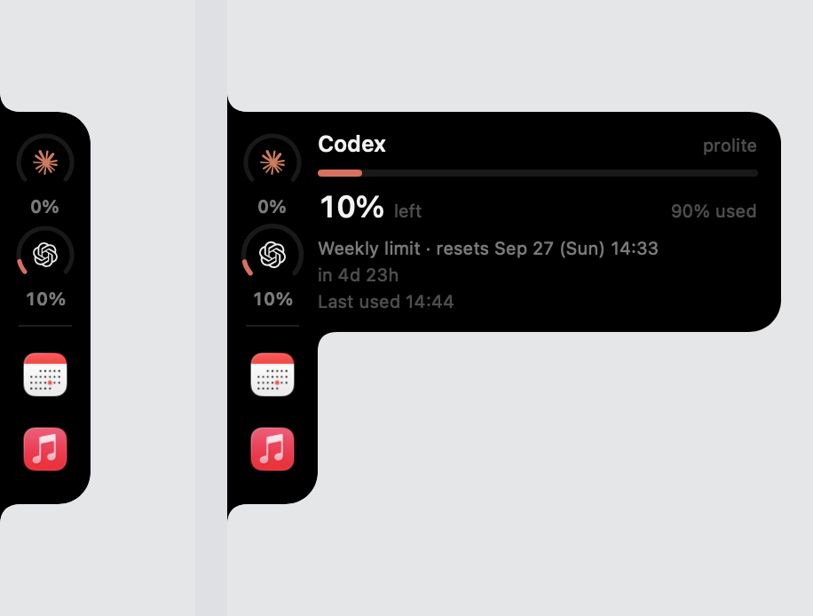

# SideNotch

A notch that grows out of the **edge** of your Mac screen, showing how much of
your Claude Code and Codex allowance is left. Drag it and it slides along the
left, top and right edges, turning the corners as it goes. Hover a logo and it stretches
sideways with the details. Drop apps on it and they become launchers.

**[한국어 README](README.ko.md)**



Docked to any of three edges — it rotates to match, and the detail opens away
from the screen.


```
idle                 hovering a logo
┌──┐                ┌──┬────────────────────┐
│◍ │ 47%            │◍ │ Codex       prolite│
│◍ │ 24%            │◍ │ ▬▬▭▭▭▭▭▭▭▭▭▭▭▭▭▭▭ │
└──┘                └──┤ 24% left    76% used│
 51×148pt              └────────────────────┘
                        312×148pt — height never changes
```

Only the logos react to hover. The black body and everything outside it let
clicks through to whatever is underneath.

## Why

Both CLIs already know how much allowance you have left — they just bury it.
Codex writes the server's own verdict into its rollout log on every turn, and
Claude Code records token usage for every message. This reads those files and
puts the number where you can see it without breaking flow.

## Install

Requires macOS 14+ and Xcode (for the Swift toolchain).

```bash
git clone https://github.com/weemiles/sidenotch.git
cd sidenotch
./install.sh
```

Installs to `/Applications/SideNotch.app` and launches it. The menu bar icon has
**Launch at login**, plus refresh and settings.

`./build.sh` alone just produces `build/SideNotch.app` without installing.

The app is ad-hoc signed on your machine, so Gatekeeper leaves it alone. It is
not sandboxed and asks for no permissions — it only reads files in your home
directory.

## Reading the gauges

Like a battery: the arc shows what is **left**.

| Remaining | Colour |
|---|---|
| above 30% | green |
| 10 – 30%  | amber |
| 10% or less | red |

## Where the numbers come from

| Shown | Source | Accuracy |
|---|---|---|
| Codex usage and reset time | `~/.codex/sessions/**/rollout-*.jsonl` → `rate_limits` | **exact** — the server sends it every turn |
| Claude 5-hour window | `~/.claude/projects/**/*.jsonl` → `message.usage` | **estimate** |

Claude Code does not record how much of your quota is gone. The limit is worked
out server-side, per organisation, and nothing in the local logs reproduces it —
windows with far more tokens than a rejected one can pass fine, so token count
alone is not the metric either.

So the Claude gauge is **price-weighted spend in the current 5-hour window
divided by a budget you set**, and the panel labels it `추정` (estimate). It is a
sense of how much you have burned, not a quota warning. The Codex gauge is the
server's own number and needs no such caveat.

Weighting uses list-price ratios per model and cache type (Opus/Sonnet/Haiku,
5m/1h cache writes, cache reads). Only the ratios matter, not the absolute
dollars.

### Picking a budget

`claudeFiveHourBudgetUSD` is just where the gauge hits empty. Watch it for a few
days: if it is always green, lower it; always red, raise it. The default suits
heavy use and will read green for lighter sessions.

## App shortcuts

Drag an app from Finder or the Dock onto the rail and it lands under the gauges.

| Action | Result |
|---|---|
| Drop an app on the rail | Added. The rail stretches and the icon springs into place |
| Click an icon | Launches it |
| Drag an icon 46pt sideways and release | Removed, the way you drag things off the Dock |

Paths live in `shortcuts` in the config. Icons dim when the app is gone.

The sideways panel is sized to the gauge rows only, so shortcuts lengthen the
rail without lengthening what pops out.

## Settings

`~/.config/sidenotch/config.json`

| Key | Default | Meaning |
|---|---|---|
| `claudeFiveHourBudgetUSD` | `400` | Where the Claude gauge reads empty |
| `fastPollSeconds` | `2` | Live sessions and the Codex tail |
| `slowPollSeconds` | `20` | Claude token log scan |
| `showClaude` / `showCodex` | `true` | Which gauges to show |
| `displayID` | `null` | Which display; `null` means the primary one |
| `edge` | `"left"` | Which edge: `left`, `top` or `right` |
| `anchor` | `0.5` | Position along that edge; `0` start, `1` end |
| `shortcuts` | `[]` | Dropped apps |

Menu bar → **설정 다시 읽기** to apply edits.

## Controls

| Action | Result |
|---|---|
| Hover a logo | Stretches sideways with that service's detail |
| Move to the other logo | Contents swap; size stays put |
| Click a logo | Pins it open. A green bar appears under the logo |
| Click again | Unpins |
| Drag a logo | Slides the notch along the edges, rotating at the corners. Saved on release |

There is a 120ms grace period on leaving a logo so the panel does not snap shut
while you move into it.

## Motion

Inspired by the gooey plus menu on [transitions.dev](https://transitions.dev).

| | |
|---|---|
| Open | `460ms cubic-bezier(0.34, 1.56, 0.64, 1)` — overshoots |
| Close | `330ms cubic-bezier(0.22, 1, 0.36, 1)` — no overshoot, quicker |
| Row stagger | `52ms` apart, starting `155ms` in |
| Row entry | `235ms`, `opacity 0→1` + `blur 2px→0` + `x -10→0` |
| Icons in and out | `spring(response: 0.50, dampingFraction: 0.58)` |

The asymmetry is the point. Bouncing on the way out but not on the way back is
what stops it reading as a mechanical toggle. Icons land with low damping so they
wobble into place.

## How it holds together

```
Sources/SideNotch/
├─ App/
│  ├─ AppMain.swift        entry point, single-instance lock
│  ├─ AppDelegate.swift    menu bar item, login item
│  ├─ NotchPanel.swift     non-activating panel, click-through, drop target
│  └─ NotchController.swift  edge placement, dragging, displays
├─ UI/
│  ├─ NotchShape.swift     rail and bulge silhouettes
│  ├─ RingGauge.swift      arc gauge and meter
│  ├─ RootView.swift       rail, shortcuts, hover state
│  ├─ WidgetPanel.swift    what the bulge reveals
│  ├─ SVGPath.swift        SVG path parser
│  ├─ BrandMark.swift      logo path data
│  ├─ Strings.swift       Korean / English strings
│  └─ Theme.swift          colour, spacing, motion
└─ Data/
   ├─ ClaudeReader.swift   live sessions plus incremental token scan
   ├─ CodexReader.swift    rollout log tail
   ├─ UsageStore.swift     two-rate polling
   ├─ Shortcut.swift       dropped apps
   ├─ UsageModel.swift     models and formatters
   └─ Config.swift         settings file
```

### Things that took a while to get right

**Reading Claude's logs cheaply.** They run to hundreds of megabytes. Each file
is remembered by byte offset and only freshly appended bytes are parsed; events
older than 12 hours are dropped.

**Picking the right Codex log.** A rollout file lives in the folder for the day
its session *started*, so one opened last night and still running today stays in
yesterday's folder while today's folder holds a stale short session. Taking "the
newest file in today's folder" reads the wrong one. Instead the last seven day
folders are scanned, the eight most recently written files are candidates, and
the one whose last `rate_limits` record carries the newest timestamp wins.

**Sitting flush against the screen edge.** `NSHostingView` inherits a safe-area
inset that leaves the shape a few points short of the edge, which kills the whole
"growing out of the bezel" effect. `view.safeAreaRegions = []`.

**Accepting drops.** AppKit finds a drop target through `hitTest`, so a
click-through rail never receives them. The whole rail is reported as a hit
region — the trade-off being that the black body no longer passes clicks.

**Dragging along the edges.** Three separate traps. `DragGesture.translation` is
measured in the view, and the view rides along with the window being dragged, so
it reports exactly half the real movement. Crossing a corner rebuilds the rail
from a column into a row, which tears the gesture down mid-drag. And a timer
scheduled during a drag never fires, because the run loop is in `.eventTracking`
rather than the default mode. So the gesture only signals that a drag has
started; a timer registered in `.common` polls `NSEvent.mouseLocation` and
`NSEvent.pressedMouseButtons` from there.

**One silhouette, three edges.** Only the left-edge path is written out. `right`
mirrors it, `top` transposes it and is built from a rect with its width and
height swapped. Text never rotates, so the layout picks a `VStack` or `HStack`
per edge and the detail block keeps the same size either way — what changes is
which of its two dimensions points away from the screen.

**Joining the two shapes.** The rail's top-right corner curve and the bulge's
top-left curve bend opposite ways and leave a dent. The bulge's left corners are
square and the overlap reaches past the rail's corner radius, so its flat top
covers the curve. Where the rail continues below the bulge, a concave fillet
matching the notch curve carries the edge back in.

**Running once.** Two copies stack two slightly different islands and it reads as
a broken shape rather than two windows. A `flock` on
`~/.config/sidenotch/run.lock` makes a second launch exit immediately.

## Adding a widget

Add a `WidgetSpec` to `RootView.specs` and a branch in `WidgetBody`. Box height
comes from `Metrics.contentHeight(gauges:shortcuts:)`; new detail has to fit it
or it gets clipped.

## Debugging

```bash
SIDENOTCH_DEBUG=1 .build/release/SideNotch 2>dbg.log
```

Logs hover transitions, the window's click-through regions, panel geometry and
drop hit-testing.

Note that `CGWarpMouseCursorPosition` does not refresh hover tracking when moving
within the same window — leave and re-enter, and trust this log over screenshots.

## Language

The interface follows your system language — Korean on a Korean Mac, English
everywhere else. Every string lives in `UI/Strings.swift`; `SIDENOTCH_LANG=en`
or `ko` forces one.

## Credits

Logos are the official single-path outlines from
[simple-icons](https://simple-icons.org) (CC0), parsed at runtime. They are the
trademarks of their respective owners and are used only to label which limit is
which.

## License

[MIT](LICENSE)
